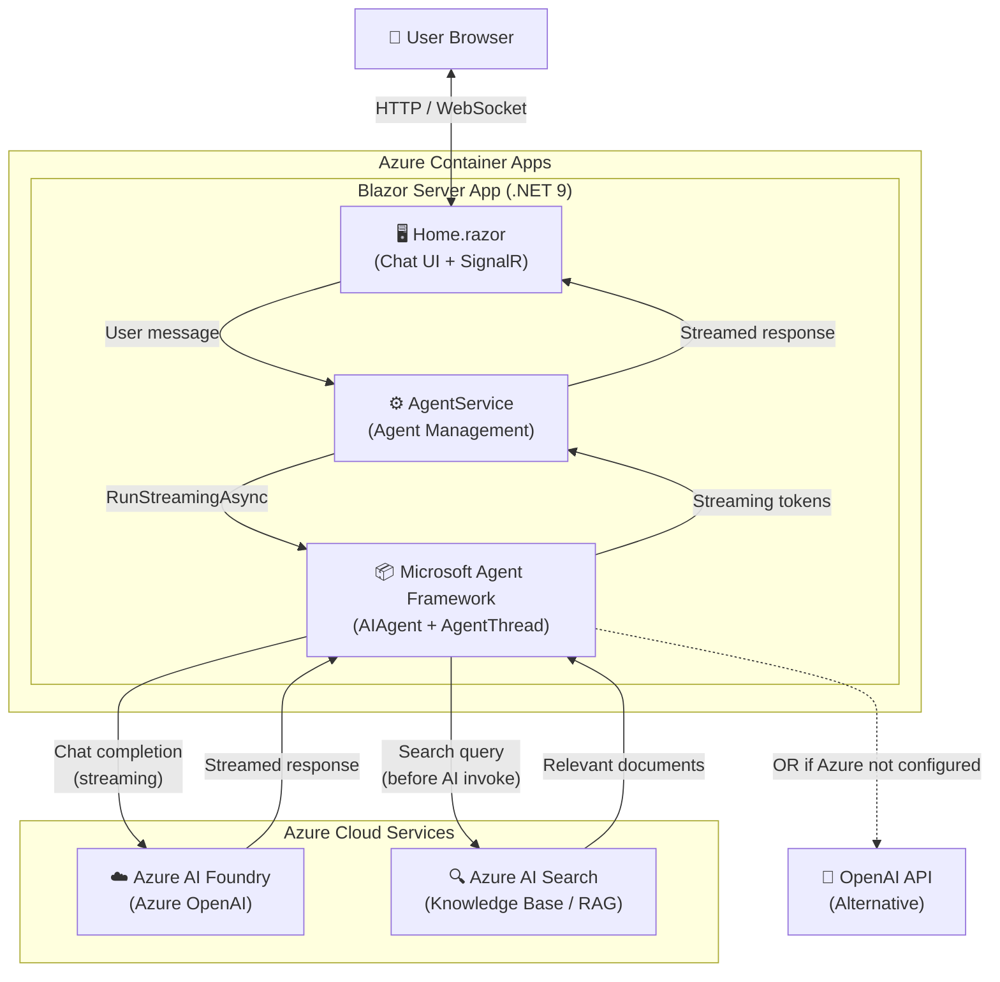

# GEORGIE - AI Chat Assistant

A modern AI chat web application built with Blazor Server and Microsoft Agent Framework, featuring Azure AI Foundry and Azure AI Search RAG integration.

## 🤖 Features

- **GEORGIE AI Assistant** - Conversational AI with personality
- **Real-time Chat Interface** - Beautiful, responsive Blazor UI with streaming responses
- **Azure AI Foundry Support** - Works with Azure OpenAI deployments
- **Azure AI Search RAG** - Knowledge base integration for grounded responses
- **OpenAI Compatible** - Also works with standard OpenAI API
- **Azure Container Apps Ready** - Optimized for cloud deployment
- **Function Calling** - Extensible tool integration

## 🚀 Quick Start

### Prerequisites

- [.NET 9.0 SDK](https://dotnet.microsoft.com/download/dotnet/9.0)
- Azure AI Foundry endpoint OR OpenAI API key
- (Optional) Azure AI Search for knowledge base

### Run Locally

1. **Configure settings** in `ChatAgent.Web/appsettings.Development.json`:
   ```json
   {
     "AZURE_OPENAI_ENDPOINT": "https://your-resource.openai.azure.com/",
     "AZURE_OPENAI_KEY": "your-key",
     "AZURE_OPENAI_DEPLOYMENT": "gpt-4o-mini",
     "AZURE_SEARCH_ENDPOINT": "https://your-search.search.windows.net",
     "AZURE_SEARCH_KEY": "your-search-key",
     "AZURE_SEARCH_INDEX": "your-index-name"
   }
   ```

2. **Run the application**:
   ```powershell
   cd ChatAgent.Web
   dotnet run
   ```

3. **Open browser**: Navigate to `http://localhost:5000`

## 📁 Project Structure

```
georgie-ai-chat/
├── ChatAgent.Web/              # Blazor web application
│   ├── Components/
│   │   ├── Pages/             
│   │   │   └── Home.razor     # Main chat interface
│   │   └── Layout/            # App layout components
│   ├── Services/
│   │   └── AgentService.cs    # AI agent management
│   ├── wwwroot/
│   │   └── app.css            # GEORGIE styling
│   ├── appsettings.json       # Base configuration
│   └── appsettings.Development.json  # Local secrets (gitignored)
├── Dockerfile                 # Container image definition
├── DEPLOYMENT.md              # Azure deployment guide
└── README.md                  # This file
```

## 📐 Architecture

### Solution Diagram



### UI Screenshot


The chat interface features:
- **Purple/indigo gradient** header with connection status
- **Bubble-style messages**: user messages on the right (purple), assistant on the left (grey)
- **Streaming responses** displayed in real-time as the AI generates text
- **Textarea input** with Enter-to-send support and a Send button

## ☁️ Azure Deployment

Deploy to Azure Container Apps in minutes. See [DEPLOYMENT.md](DEPLOYMENT.md) for detailed instructions.

### Quick Deploy

```bash
# Build and deploy with Azure CLI
az containerapp up \
  --name georgie \
  --resource-group rg-georgie \
  --location eastus \
  --source . \
  --ingress external \
  --target-port 8080
```

## 🔧 Configuration

### Azure AI Foundry (Recommended)

```json
{
  "AZURE_OPENAI_ENDPOINT": "https://your-resource.openai.azure.com/",
  "AZURE_OPENAI_KEY": "your-key",
  "AZURE_OPENAI_DEPLOYMENT": "gpt-4o-mini"
}
```

### OpenAI API

```json
{
  "OPENAI_API_KEY": "sk-your-key"
}
```

### Azure AI Search (Optional RAG)

Add knowledge base integration:

```json
{
  "AZURE_SEARCH_ENDPOINT": "https://your-search.search.windows.net",
  "AZURE_SEARCH_KEY": "your-key",
  "AZURE_SEARCH_INDEX": "your-index-name"
}
```

**Important**: Your index must have these fields:
- `content_text` - Main document content
- `document_title` - Document title
- `content_path` - Source path/URL

## 🎨 Customization

### Change AI Model

Edit `ChatAgent.Web/Services/AgentService.cs`:

```csharp
private const string ModelDeployment = "gpt-4"; // Your model
```

### Add Custom Functions

In `AgentService.cs`, add new function tools:

```csharp
[Description("Calculate the sum of two numbers")]
public static int Add(
    [Description("First number")] int a,
    [Description("Second number")] int b)
{
    return a + b;
}

// Register in CreateAgent():
Tools = [
    AIFunctionFactory.Create(GetWeather),
    AIFunctionFactory.Create(Add)
]
```

### Modify UI Theme

Edit `ChatAgent.Web/wwwroot/app.css` to customize colors and styling. Current theme uses indigo/purple gradients (#6366f1, #8b5cf6).

### Adjust Search Behavior

In `AgentService.cs`, modify `TextSearchProviderOptions`:

```csharp
var textSearchOptions = new TextSearchProviderOptions
{
    SearchTime = TextSearchProviderOptions.TextSearchBehavior.BeforeAIInvoke,
    RecentMessageMemoryLimit = 5,
    SearchResultLimit = 10,  // More results
    ContextPrompt = "Your custom prompt here"
};
```

## 🧪 Local Development

### Run with Hot Reload

```powershell
cd ChatAgent.Web
dotnet watch run
```

### Build Docker Image Locally

```powershell
docker build -t georgie:latest .
docker run -p 8080:8080 `
  -e AZURE_OPENAI_ENDPOINT="your-endpoint" `
  -e AZURE_OPENAI_KEY="your-key" `
  -e AZURE_OPENAI_DEPLOYMENT="your-deployment" `
  georgie:latest
```

### Debug in VS Code

Launch configurations are included for debugging the Blazor app.

## 📚 Documentation

- **[DEPLOYMENT.md](DEPLOYMENT.md)** - Complete Azure Container Apps deployment guide
- **[ChatAgent.Web/README.md](ChatAgent.Web/README.md)** - Detailed web application documentation
- **[Microsoft Agent Framework](https://learn.microsoft.com/agent-framework/)** - Official framework docs

## 🔐 Security Best Practices

- ✅ Never commit `appsettings.Development.json` (already in `.gitignore`)
- ✅ Use Azure Key Vault for production secrets
- ✅ Rotate API keys regularly
- ✅ Use managed identities in Azure environments
- ✅ Enable HTTPS in production
- ✅ Restrict CORS origins appropriately

## 🛠️ Technology Stack

- **.NET 9.0** - Latest framework
- **Blazor Server** - Interactive server-side rendering
- **Microsoft Agent Framework 1.0.0-preview** - AI agent capabilities
- **Azure AI Foundry** - OpenAI model hosting
- **Azure AI Search** - Knowledge base RAG
- **SignalR** - Real-time WebSocket communication
- **Docker** - Containerization

## 📦 NuGet Packages

```xml
<PackageReference Include="Microsoft.Agents.AI" Version="1.0.0-preview.251204.1" />
<PackageReference Include="Microsoft.Agents.AI.OpenAI" Version="1.0.0-preview.251204.1" />
<PackageReference Include="Azure.AI.OpenAI" Version="2.1.0" />
<PackageReference Include="Azure.Search.Documents" Version="11.7.0" />
```

## 🤝 Contributing

This is a demo project showcasing Microsoft Agent Framework capabilities. Feel free to:
- Fork and modify for your use case
- Report issues or suggest improvements
- Share your implementations

## 📄 License

This project uses preview packages from Microsoft Agent Framework. Review license terms for each package.

## 🆘 Troubleshooting

### "Cannot connect to endpoint"
- Verify `AZURE_OPENAI_ENDPOINT` format includes `https://` and trailing `/`
- Check Azure resource is deployed and accessible

### "Search returning empty results"
- Confirm index field names match: `content_text`, `document_title`, `content_path`
- Check index has documents and is queryable
- Verify search key has read permissions

### "Rate limit exceeded"
- Reduce concurrent requests
- Upgrade Azure OpenAI tier
- Implement retry logic with backoff

### "Build fails in Docker"
- Ensure .NET 9.0 SDK installed locally
- Check Dockerfile targets correct .csproj path
- Verify all NuGet packages restore successfully

## 🎯 Use Cases

GEORGIE is ideal for:
- **Internal Knowledge Bases** - Employee documentation search
- **Customer Support** - Product documentation RAG
- **IT Helpdesk** - Technical documentation assistant
- **Research Tools** - Academic paper search and summarization
- **Training Materials** - Educational content Q&A

## 🚀 What's Next?

Enhance GEORGIE with:
- **Authentication** - Add Azure AD B2C for user login
- **Conversation History** - Persist threads in Cosmos DB
- **Multi-tenancy** - Isolate users and data
- **Advanced Search** - Vector search with embeddings
- **Analytics** - Track usage and satisfaction
- **Voice Input** - Add speech-to-text capabilities

---

Built with ❤️ using Microsoft Agent Framework
